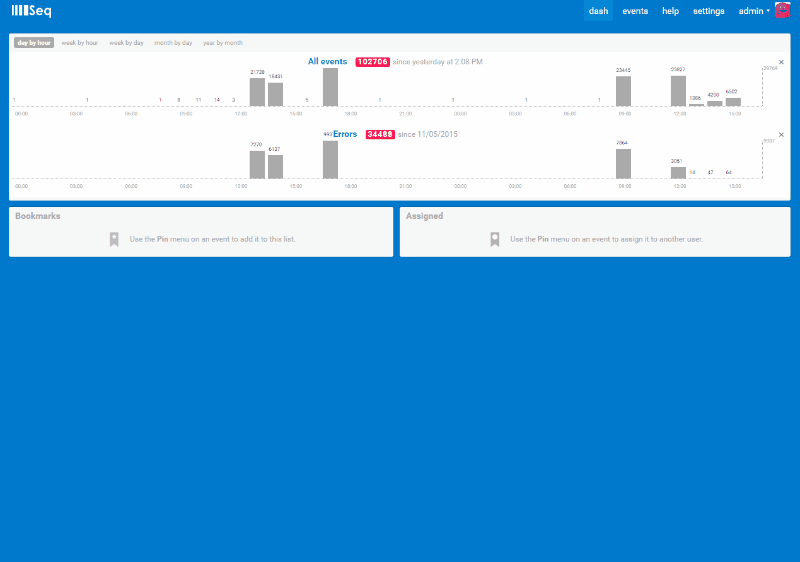

# ServiceStack.Seq.RequestLogsFeature

[](https://ci.appveyor.com/project/MacLeanElectrical/servicestack-seq-requestlogsfeature/branch/master)
[](https://badge.fury.io/nu/ServiceStack.Seq.RequestLogsFeature)

A ServiceStack plugin that logs requests to [Seq](http://getseq.net). For more details view the [blog post](http://wwwlicious.com/2015/10/25/logging-servicestack-requests-with-seq/)

*NB. This version is compatible with ServiceStack v5.x. For v3 compatibility, use the v3 branch*

# Installing

The package is available from nuget.org

`Install-Package ServiceStack.Seq.RequestLogsFeature`

# Requirements

You must have an instance of seq server to post to. You can download and install a copy of Seq [here](http://getseq.net).
>Out of the box, Seq includes a **free single-user license** without authentication support.

Once you have it installed, you can check it is running locally on the default port [http://localhost:5341](http://localhost:5341)

# Quick Start

In your `AppHost` class `Configure` method, add the plugin. By default configuration values are read from the registered `IAppSettings` instance. By default this will be an instance of `AppSettings`, if an alternative implementation of `IAppSettings` is to be used it must be registered prior to this plugin being registered.
Alternatively all configuration options are exposed as public properties of the feature class.

```csharp
public override void Configure(Container container)
{
    // Basic setup. All config read from AppSettings
    Plugins.Add(new SeqRequestLogsFeature());

	// Register plugin, setting optional properties via object initialiser
    Plugins.Add(new SeqRequestLogsFeature
    {
        // add additional properties to Seq log entry.
        AppendProperties = (request, dto, response, duration) =>
            new Dictionary<string, object> { { "NewCustomProperty", "42" } },
        ExcludeRequestDtoTypes = new[] { typeof(SeqRequestLogConfig) }, // add your own type exclusions
        HideRequestBodyForRequestDtoTypes = new[] { typeof(SeqRequestLogConfig) } // add your own exclusions for bodyrequest logging
    });
}
```
### Configuration Options
| Property | Description | AppSettings key |
| --- | --- | --- |
| SeqUrl | URI of Seq server. Required | servicestack.seq.requestlogs.seq.url|
| ApiKey | Seq Api Key | servicestack.seq.requestlogs.seq.apikey|
| Enabled | Default True | servicestack.seq.requestlogs.enabled|
| EnableErrorTracking | Default True | servicestack.seq.requestlogs.errortracking.enabled|
| EnableRequestBodyTracking | Default False | servicestack.seq.requestlogs.requestbodytracking.enabled|
| EnableSessionTracking | Default False | servicestack.seq.requestlogs.sessiontracking.enabled|
| EnableResponseTracking | Default False | servicestack.seq.requestlogs.responsetracking.enabled|
| AppendProperties | Add additional properties to log | N/A|
| RawEventLogger | Delegate for custom logging | responsetracking.enabled|
| Logger | Swap out seq logger for custom implementation | responsetracking.enabled|
| RequiredRoles | Restrict the runtime configuration to specific roles | servicestack.seq.requestlogs.requiredroles|
| HideRequestBodyForRequestDtoTypes | Type exclusions for body request logging | N/A|
| ExcludeRequestDtoTypes | Type exclusions for logging | N/A|


### Request Correlation

This plugin will detect the default header `x-mac-requestid` created by [ServiceStack.Request.Correlation](https://github.com/MacLeanElectrical/servicestack-request-correlation)
and add this as a property. This is useful for tracking requests from their point of origin across multiple services

### Runtime configuration

You can change the logging configuration at runtime 

```csharp
var request = new SeqRequestLogConfig
                    {
                        Enabled = false,
                        EnableRequestBodyTracking = false,
                        EnableErrorTracking = false,
                        EnableSessionTracking = false,
                        EnableResponseTracking = false
                    };

var client = new JsonServiceClient("http://myservice");
client.Send(request);
```

### Metadata page


### Logging in action

Once you start your `AppHost`, every request will be now logged to seq using the default options or the options you provided.
Logging levels are colour coded and depending on your settings, the full requestDto's and even responseDto's are available to search.

In the example below you can see just a few examples of how the log data can be manipulated. For more info on the power of seq and 
structured logging, see [the docs](http://docs.getseq.net/docs)


